# 🌐 How the Internet Works

## 📑 Table of Contents

1. [Introduction to the Concept of the Internet](#1-introduction-to-the-concept-of-the-internet)
2. [Overview of the World Wide Web (WWW)](#2-overview-of-the-world-wide-web-www)
3. [How Data is Transferred Across Networks](#3-how-data-is-transferred-across-networks)
4. [Understanding IP Addresses, Domain Names, and Routing](#4-understanding-ip-addresses-domain-names-and-routing)
5. [Key Concepts: ISPs, Routers, DNS](#5-key-concepts-isps-routers-dns)
6. [One-Flow Summary](#6-one-flow-summary-golden-for-interviews)

---

## 1. Introduction to the Concept of the Internet

### What is it?
In simple words: **The Internet is a Network of Networks.**

It consists of millions of computers (servers + clients = devices) connected globally. They communicate using standard rules known as **Protocols**.

> **Definition:** "The internet is a global system of interconnected computer networks that communicate using standard protocols to exchange data and information."

### ⚠️ Important Distinctions
It is crucial to understand what the internet is *not*:
*   ❌ Internet $\neq$ Website (World Wide Web)
*   ❌ Internet $\neq$ Browser (Chrome, Firefox, Safari)
*   ❌ Internet $\neq$ Google, Facebook, YouTube

**The Internet is infrastructure**—like roads, bridges, and highways that connect different places. Websites are merely services that run *on top* of this infrastructure.

### Examples of Internet Usage
*   📧 Sending an email
*   🌐 Browsing a website (e.g., `www.example.com`)
*   📂 FTP (File Transfer Protocol)
*   📹 Video calling (Zoom, Skype)

*All of these use the same Internet but rely on different protocols to communicate.*

---

## 2. Overview of the World Wide Web (WWW)

### What is the WWW?
The **WWW (World Wide Web)** is a service running on the internet used to access web pages and documents. It functions primarily using **HTTP/HTTPS** protocols.

> **Definition:** "The World Wide Web is a system of interlinked web pages accessed over the internet using HTTP/HTTPS protocols."

### 🆚 Internet vs. WWW

| Feature | Internet | World Wide Web (WWW) |
| :--- | :--- | :--- |
| **Nature** | Infrastructure | Service |
| **Structure** | Network of networks | Collection of websites |
| **Protocols** | Uses many protocols (TCP, IP, FTP, etc.) | Mainly HTTP/HTTPS protocols |
| **Dependency** | Exists without the Web | Depends entirely on the Internet |

### 💡 Analogy
*   **Internet** = Roads and highways (Infrastructure)
*   **WWW** = Shops located on those roads (Websites)

---

## 3. How Data is Transferred Across Networks

This is the core logic of networking.

### The Data Transfer Process: Packet Switching
Data is **NOT** sent as one big file (like a physical letter). Instead, the internet uses **Packet Switching**.

1.  **Fragmentation**: Data is broken into smaller chunks called **packets**.
2.  **Packet Structure**: Each packet contains:
    *   Source IP address
    *   Destination IP address
    *   Sequence number (to reassemble packets in order)
    *   Payload (actual data)
3.  **Transmission**: Each packet is sent independently across the network. They may take different routes to reach the destination.
4.  **Reassembly**: The destination device reassembles the packets in the correct order.

> **Definition:** "The Internet uses packet switching, where data is divided into smaller packets that are routed independently and reassembled at the destination."

### Why Packet-Based Transfer?
*   🚀 **Efficient**: Faster use of network resources.
*   🛡️ **Reliable**: If one packet is lost, only that specific packet needs to be resent.
*   🔄 **Fault-tolerant**: The network can adapt to failures by automatically rerouting packets via other paths.
*   🌍 **Scalable**: Can accommodate a growing number of devices.

---

## 4. Understanding IP Addresses, Domain Names, and Routing

### 📍 IP Address
An **IP Address** is a unique identifier for a device on a network.

*   **IPv4**: 32-bit address (e.g., `192.168.1.1`)
*   **IPv6**: 128-bit address (e.g., `2001:0db8:85a3...`)

> **Definition:** "An IP address is a unique identifier assigned to a device to enable communication over a network."

### 🏷️ Domain Names
Humans cannot remember numeric IP addresses easily, so we use **Domain Names**.

*   **Mapping**: `google.com` $\rightarrow$ `142.250.64.110`
*   **Usage**: Domain names are human-friendly; computers still use IP addresses to communicate.

> **Definition:** "Domain names are human-friendly addresses that map to IP addresses, making it easier to access websites."

### 🔀 Routing (How packets find the path)
**Routing** is the process of finding the best path from source to destination.

*   **Routers**: Devices that forward packets between networks.
*   **Decision Making**:
    *   Where to send packets next based on the destination IP.
    *   Best path based on network conditions (congestion, failures).
    *   Uses routing tables and protocols (like BGP, OSPF).

> **Definition:** "Routing is the process of selecting paths in a network along which data packets travel, facilitated by routers."

### 💡 Analogy
*   **IP Address** = Home address
*   **Domain Name** = Contact name saved in a phone
*   **Router** = Postal service sorting center (or courier hubs deciding the next city)

---

## 5. Key Concepts: ISPs, Routers, DNS

### 🏢 Internet Service Providers (ISPs)
An **ISP** is a company that connects you to the internet.
*   *Examples*: Jio, Airtel, Act, BSNL, AT&T, Verizon.

**What an ISP does:**
1.  Assigns an IP address to your device.
2.  Connects you to the global internet (via fiber, DSL, cable, wireless).
3.  Routes your traffic to/from the internet.

> **Definition:** "An Internet Service Provider (ISP) provides access to the internet by assigning IP addresses and routing traffic between users and global networks."

### 🚦 Routers
The **Router** acts as the "Traffic Police" of the internet.

*   **Home Router**: Connects your home devices to the ISP (Local Network) via Wi-Fi or Ethernet.
*   **Internet Routers**: Connect ISPs together (Backbone of the internet) and manage data flow on a global scale.

> **Definition:** "A router is a networking device that forwards data packets between computer networks based on their IP addresses."

### 📖 DNS (Domain Name System)
**DNS** is the "Phonebook of the Internet".

**Function:**
Translates domain names into IP addresses.
```text
Domain Name      ->   IP Address
google.com       ->   142.250.64.110
```

Without DNS, users would have to memorize IP addresses to access websites.

> **Definition:** "DNS (Domain Name System) translates human-readable domain names into machine-readable IP addresses."

---

## 6. One-Flow Summary:

1.  **IP Address**: Unique identifier for a device on a network (e.g., `192.168.1.1`).
2.  **Domain Name**: Human-friendly address mapped to an IP address (e.g., `google.com`).
3.  **Routing**: Process of finding the best path for data packets (facilitated by routers).
4.  **ISP**: Company that connects users to the internet and assigns IP addresses.
5.  **DNS**: Translates domain names into IP addresses (like a phonebook).


## 🌟 The Big Picture
> **The internet is a global network of interconnected computers. When a user accesses a website, the domain name is resolved using DNS to obtain the IP address. Data is transmitted in packets across networks using routers, routed through ISPs, and reassembled at the destination to display web content via the World Wide Web (WWW).**

---
## `Diagram:` How the Internet Works

```mermaid
flowchart TD
    %% Nodes
    User([👤 User])
    Browser[🖥️ Browser]
    DNS[📖 DNS Server]
    ISP[🏢 ISP]
    Routers{🚦 Routers}
    Internet((🌍 Internet))
    Server[💾 Destination Server]

    %% Connections
    User -->|Enters URL| Browser
    Browser -->|1. Asks for IP| DNS
    DNS -->|2. Returns IP Address| Browser
    Browser -->|3. Sends Request| ISP
    ISP -->|4. Forwards Traffic| Routers
    Routers -->|5. Selects Best Path| Internet
    Internet -->|6. Packet Switching| Server
    Server -->|7. Sends Response| Internet
    Internet -->|8. Returns Data| Browser
    Browser -->|9. Renders Page| User

    %% Styling
    %% Colors chosen for high contrast and readability in both Light and Dark modes
    classDef user fill:#e1bee7,stroke:#4a148c,stroke-width:2px,color:#000;
    classDef tech fill:#bbdefb,stroke:#0d47a1,stroke-width:2px,color:#000;
    classDef infra fill:#ffecb3,stroke:#ff6f00,stroke-width:2px,color:#000;
    classDef server fill:#c8e6c9,stroke:#1b5e20,stroke-width:2px,color:#000;

    class User user;
    class Browser,DNS tech;
    class ISP,Routers,Internet infra;
    class Server server;
```



[Next: 2-DNS-Magic-and-Internals](./2-DNS-Magic-and-Internals.md) `or` [Back to 01-Web-Basics](./README.md) `or` [Home](../README.md)
