# DNS Magic and Internals

## Table of Contents

- [What is DNS (Domain Name System)?](#what-is-dns-domain-name-system)
- [How DNS Resolves Domain Names to IP Addresses](#how-dns-resolves-domain-names-to-ip-addresses)
    - [Visual Flow of DNS Resolution](#visual-flow-of-dns-resolution)
    - [Step-by-Step DNS Resolution Process](#step-by-step-dns-resolution-process)
- [Types of DNS Records (Very Interview-Important)](#types-of-dns-records-very-interview-important)
- [DNS Hierarchy](#dns-hierarchy)
- [How Browsers Query DNS to Load Websites](#how-browsers-query-dns-to-load-websites)
- [Key Concepts](#key-concepts)
- [Common Questions](#common-questions)

---

## What is DNS (Domain Name System)?

DNS = **Domain Name System**

- **DNS is the internet’s phonebook.**
- It converts **human-readable domain names** (like `google.com`) into **machine-readable IP addresses** (like `142.250.72.14`).

### Why DNS Exists?

*   Humans ❌ remember numbers.
*   Computers ❌ understand names.
*   DNS = **Bridge between humans and machines**.

 **Without DNS, we have to type:**
```http
http://142.250.72.14
```
**Instead of:**
```http
http://google.com
```

### Explanation
DNS servers store a huge database of domain names and their corresponding IP addresses. When you enter a URL in your browser, it queries the DNS server to find the IP address associated with that domain name.

---

## How DNS Resolves Domain Names to IP Addresses
### Visual Flow of DNS Resolution

```mermaid
sequenceDiagram
    participant User as 👤 User
    participant Browser as 🌐 Browser
    participant Resolver as 🔄 Recursive Resolver (ISP)
    participant Root as 🌳 Root Server (.)
    participant TLD as 🏷️ TLD Server (.com)
    participant Auth as 🏢 Authoritative Server (example.com)

    User->>Browser: Types "www.example.com"
    Browser->>Browser: Check Cache? ❌
    Browser->>Resolver: Where is www.example.com?
    
    Note over Resolver: Resolver checks its cache first... ❌
    
    Resolver->>Root: Where is .com?
    Root-->>Resolver: Go to TLD Server (.com) [IP]
    
    Resolver->>TLD: Where is example.com?
    TLD-->>Resolver: Go to Authoritative Server [IP]
    
    Resolver->>Auth: What is IP for www.example.com?
    Auth-->>Resolver: IP is 93.184.216.34 ✅
    
    Resolver-->>Browser: Here is the IP: 93.184.216.34
    Browser->>Browser: Caches IP for later 💾
    Browser->>User: Loads Website 🚀
```


### Step-by-Step DNS Resolution Process

When you type:
```
www.example.com
```

### Actual Flow:

1.  **Browser Cache**
    *   Already visited? → IP direct ga use chestadi.
2.  **OS Cache**
    *   System level DNS cache check.
3.  **Recursive DNS Resolver** (usually ISP / Google DNS `8.8.8.8`)
    *   If not found, it starts asking others.
4.  **Root DNS Server**
    *   “.com ekkada?” ani adugutadi.
5.  **TLD Server (.com)**
    *   “example.com authority evaru?” ani cheptadi.
6.  **Authoritative DNS Server**
    *   Final answer:
    *    `example.com = 93.184.216.34`
7.  **IP Returned to Browser**
    *   Website load start 🚀


> "DNS resolution is a hierarchical lookup process involving root, TLD, and authoritative servers."

---

## Types of DNS Records (Very Interview-Important)

### 🔹 A Record
*   Maps **domain → IPv4 address**.
```
example.com → 93.184.216.34
```

### 🔹 AAAA Record
*   Maps **domain → IPv6 address**.

### 🔹 CNAME (Canonical Name)
*   Alias for another domain.
```
www.example.com → example.com
```

### 🔹 MX Record (Mail Exchange)
*   Email servers define chestadi.
```
example.com → mail.google.com
```

### 🔹 TXT Record
*   Verification & security.
*   Used for: SPF, DKIM, Domain verification.

### 🔹 NS Record
*   Authoritative name servers list.


> “CNAME points to a domain, A record points to an IP.”

---

## DNS Hierarchy

DNS works like a **tree structure** 🌳.

### Levels:

1.  **Root DNS Servers**
    *   Top level.
    *   “Where is .com?”
2.  **TLD (Top-Level Domain) Servers**
    *   `.com`, `.org`, `.in`.
3.  **Authoritative DNS Servers**
    *   Final authority for a domain.
    *   Stores actual DNS records.

### Explanation
`Root` → `TLD` → `Authoritative`.

`boss` → `Area manager` → `Final owner` 😄.

---

##  How Browsers Query DNS to Load Websites

### Browser Process:

1.  User types URL.
2.  DNS lookup happens.
3.  IP address obtained.
4.  TCP connection starts.
5.  HTTP/HTTPS request sent.
6.  Server responds with HTML/CSS/JS.

 **DNS is always BEFORE HTTP.**


> "DNS resolution happens before any HTTP request is made."

---

##  Key Concepts

### 🔁 Recursive Query
*   Resolver does **all the work**.
*   Client gets **final answer**.

### ⚡ Caching
*   DNS responses are cached.
*   Improves speed.
*   Reduces DNS traffic.

### ⏳ TTL (Time To Live)
*   How long cache is valid.
```
TTL = 300 seconds
```
*   After expiry → fresh DNS lookup.


> "TTL controls how long DNS records stay cached before re-querying."

---

##  Common Questions

### ❓ What happens if DNS fails?
👉 Website won’t load (even if server is alive).

### ❓ Why is DNS caching important?
👉 Performance + reduced latency.

### ❓ Difference between Recursive & Authoritative DNS?
*   **Recursive:** Finds answer.
*   **Authoritative:** Stores answer.
