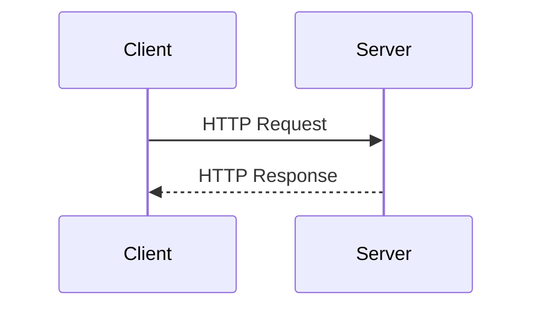

# 3. Server–Client Architecture 🧑‍💻 ↔ 🖥
---
## Table of Contents
- [What is Client - Server Model?](#what-is-client---server-model)  
- [Who is Client? Who is Server?](#who-is-client-who-is-server)  
- [Client vs Server (Clear Comparison)](#client-vs-server-clear-comparison)  
- [HTTP Request - Response Cycle](#http-request---response-cycle-%E2%AD%90) 
- [How Browsers Act as Clients](#how-browsers-act-as-clients)  
- [Web Servers & Web Hosting](#web-servers--web-hosting)  
- [Client-side vs Server-side](#client-side-vs-server-side)  
- [Request Headers & Response Codes](#request-headers--response-codes)   
- [Why Client-Server Architecture Matters?](#why-client-server-architecture-matters)  
- [Summary](#summary)

## What is Client - Server Model?

> **Client–Server architecture** is a model where **clients request resources** and **servers respond with data or services**.

### Real-life Analogy 🏨

* **Client** → You (customer)
* **Server** → Hotel kitchen
* **Request** → You order food
* **Response** → Kitchen sends food

You don’t go inside the kitchen. Similarly, **clients never access server internals directly**.

---

### Technical Explanation

1. **Client** sends a request (HTTP request)
2. **Server** processes the request
3. **Server** sends a response (HTML, JSON, image, etc.)

This is the **core of the web**.

---

## Who is Client? Who is Server?

### 🧑‍💻 Client

A **client** is any device or software that:
* Initiates a request
* Consumes data

#### Examples:
* Web browsers (Chrome, Firefox)
* Mobile apps
* Postman
* Curl

➡️ **Browser is the most common client**

---

### 🖥️ Server

A **server** is a machine/software that:
* Listens for requests
* Processes logic
* Sends responses

#### Examples:
* Web servers
* API servers
* Database servers

➡️ Server is **always ON**, client comes & goes.

---

### 💡

> “Client initiates communication, server responds and controls data and logic.”

---

## Client vs Server (Clear Comparison)

| Aspect | Client | Server |
| :--- | :--- | :--- |
| **Role** | Requests data | Provides data |
| **Starts communication** | Yes | No |
| **Examples** | Browser, Mobile App | Node.js, Java, Python server |
| **Logic** | UI, validation | Business logic, database |
| **Location** | User device | Data center / cloud |

---

## HTTP Request - Response Cycle ⭐

### Step-by-Step Flow

1. User types URL in browser
2. Browser sends **HTTP request**
3. Server receives request
4. Server processes request
5. Server sends **HTTP response**
6. Browser renders UI

### Example Diagram:

### Request Contains:
* HTTP method (GET, POST)
* URL
* Headers
* Body (optional)

### Response Contains:
* Status code (200, 404, 500)
* Headers
* Body (HTML / JSON)

---

###  🎯

> “HTTP is a request–response protocol where client requests resources and server responds with data.”

---

## How Browsers Act as Clients

Browser is **not just a UI tool**. It is a **powerful client**.

### Browser Responsibilities:
* Send HTTP requests
* Handle DNS resolution
* Parse HTML, CSS, JS
* Render UI
* Handle cookies, cache, security

### Example:
When you open `https://google.com`:

**Browser:**
1. Resolves DNS
2. Opens TCP connection
3. Sends HTTP request
4. Receives HTML
5. Renders page

➡️ Browser is a **smart client**, not dumb.

---

## Web Servers & Web Hosting

### What is a Web Server?

A **web server** is software that:
* Listens on port 80 / 443
* Handles HTTP requests
* Sends responses

### Popular Web Servers:
* **Apache** – older, flexible
* **Nginx** – fast, scalable (industry favorite)
* **Node.js** – JavaScript-based server

### Web Hosting

**Web hosting** means:
* Your server is hosted on internet
* Accessible via public IP
* Examples: AWS, Vercel, Netlify

---

### 💡

> “Web hosting provides infrastructure; web server software handles requests.”

---

## Client-side vs Server-side

### Client-Side
* Runs in browser
* Languages: HTML, CSS, JavaScript
* Focus: UI, interactions

### Server-Side
* Runs on server
* Languages: Node.js, Java, Python
* Focus: logic, database, authentication

### Example:
* Button click → **Client-side JS**
* Save data → **Server-side API**

---
###  💡

> “Client-side handles presentation, server-side handles business logic and data persistence.”

---

## Request Headers & Response Codes

### Request Headers
Extra information sent by client:
* `Authorization`
* `Content-Type`
* `User-Agent`

### Response Status Codes

| Code | Meaning |
| :--- | :--- |
| **200** | OK |
| **201** | Created |
| **400** | Bad Request |
| **401** | Unauthorized |
| **404** | Not Found |
| **500** | Server Error |

---

> “Status codes tell the client about the result of its request.”

---

##  Why Client-Server Architecture Matters?

✔ Scalable  
✔ Secure  
✔ Separation of concerns  
✔ Internet-friendly  

Without this model → **Internet doesn’t exist**

---

## Summary

> Client–Server architecture is the backbone of the web where clients initiate HTTP requests and servers respond with resources. Browsers act as clients, web servers handle requests, and communication happens through HTTP using request–response cycles. Client-side focuses on UI while server-side manages logic and data.

---

##  💣

> “In client-server architecture, the client initiates communication by sending HTTP requests, and the server processes those requests and sends responses. This separation allows scalability, security, and efficient web communication.”
