# TCP/IP: The Backbone of the Internet

## 📖 Table of Contents
1.  [Executive Summary](#executive-summary)
2.  [The Core Duo: TCP vs. IP](#the-core-duo-tcp-vs-ip)
3.  [Deep Dive: How TCP Ensures Reliability](#deep-dive-how-tcp-ensures-reliability)
4.  [The Role of IP: Addressing & Routing](#the-role-of-ip-addressing--routing)
5.  [Ports & Sockets: The Endpoints](#ports--sockets-the-endpoints)
6.  [Critical Mechanics: Handshakes & Packet Loss](#critical-mechanics-handshakes--packet-loss)
7.  [Visualizing the Flow (Sequence Diagram)](#visualizing-the-flow)
8.  [Comparison Matrix](#comparison-matrix)

---

## Executive Summary

**TCP/IP (Transmission Control Protocol/Internet Protocol)** is the fundamental suite of communication protocols used to interconnect network devices on the internet. It is the universal standard that determines how data is exchanged.

**TCP/IP is the backbone of the internet.**

### 💡 The "Postal Service" Analogy

To understand how these two work together, think of a **Parcel Delivery Service**:

*   **IP (Internet Protocol):** Acts like the **Address Label & Delivery Truck**. It knows the destination (House Address) and finds the route to get there.
*   **TCP (Transmission Control Protocol):** Acts like **Certified Mail**. It ensures the parcel arrives safely, completely, and in the correct order.

**Without TCP/IP:**
*   Data would get lost.
*   Files would be corrupted.
*   Packets would arrive in the wrong order.
*   Websites simply wouldn't load properly.

>  TCP/IP defines how data is broken down, sent, routed, received, and reassembled across the internet.

---

## The Core Duo: TCP vs. IP

These two protocols work in tandem but serve distinct purposes.

### 1. IP (Internet Protocol) 🌐
**Role:** Addressing and Routing.
*   **Function:** Defines *where* data goes.
*   **Nature:** "Best-effort" delivery. It is connectionless and does not guarantee that packets arrive.
*   **Key Components:**
    *   **Addressing:** Assigns unique IDs (IP Addresses) to devices (e.g., `192.168.1.1`).
    *   **Routing:** Determines the most efficient path data takes through routers and ISPs.

### 2. TCP (Transmission Control Protocol) 🛡️
**Role:** Reliable Delivery.
*   **Function:** Defines *how* data is sent safely.
*   **Nature:** "Connection-oriented" and reliable.
*   **Key Components:**
    *   **Segmentation:** Breaks large files (like an image) into small packets.
    *   **Sequencing:** Numbers packets so they can be reassembled in the correct order.
    *   **Error Checking:** Detects corruption and resends lost data.


---

## Deep Dive: How TCP Ensures Reliability

The internet is inherently chaotic. Packets get lost, duplicated, or scrambled. TCP solves this via four robust mechanisms:

1.  **Segmentation 📦**
    *   Data (HTML, Images, JSON) is sliced into manageable units called packets (or segments).
2.  **Sequence Numbers 🔢**
    *   Every packet is assigned a number (e.g., 1, 2, 3). The receiver uses these to reassemble data in the correct order, even if packet #3 arrives before packet #2.
3.  **Acknowledgments (ACKs) ✅**
    *   Communication is two-way. The receiver sends a signal back saying, *"I received packet #1."*
    *   If the sender does not receive an ACK within a specific timeframe, it assumes the packet was lost.
4.  **Retransmission 🔄**
    *   The sender automatically resends any unacknowledged packets to ensure **100% data integrity**.

> TCP is a connection-oriented and reliable protocol that guarantees ordered, complete, and error-free delivery.
---

## The Role of IP: Addressing & Routing

### 1. Addressing (Unique Identifiers) 
Every device connected to a network needs a unique identifier.
*   **IPv4:** The classic standard (e.g., `192.168.1.1`). It uses 32-bit addresses, limiting the total number of devices.
*   **IPv6:** The modern standard (e.g., `2001:0db8...`). It uses 128-bit addresses, providing a virtually infinite number of addresses.

### 2. Routing (How Data Travels) 
Data rarely travels in a straight line. It "hops" through a complex web of routers.
*   **Routing Tables:** Each router contains a map. When a packet arrives, the router looks at the destination IP, checks its internal table, and throws the packet to the next closest router (Next Hop).

---

## Ports & Sockets: The Endpoints

While IP gets data to the correct *computer*, Ports get data to the correct *application* running on that computer.

### Ports 🚪
Think of ports as specific doors into a building (the server).
*   **HTTP:** Port `80` (Standard Web traffic)
*   **HTTPS:** Port `443` (Secure/Encrypted web traffic)
*   **SSH:** Port `22` (Secure remote login)
*   **DNS:** Port `53` (Domain Name System)

### Sockets 🔌
A socket is the combination of an IP address and a Port. It represents a unique connection endpoint in the operating system.

```text
Socket = IP Address + Port Number
Example: 192.168.1.50:80
        
Ip = 192.168.1.50 + Port = 80 (HTTP)
Socket = 192.168.1.50:80
```

---

## Critical Mechanics: Handshakes & Packet Loss

### The Three-Way Handshake 🤝
Three way handshake is the process TCP uses to establish a reliable connection between client and server

**Before a single bit of data is exchanged, TCP establishes a virtual connection to ensure both sides are ready.**

1.  **SYN (Synchronize):** Client asks, *"Can we connect?"*
2.  **SYN-ACK (Synchronize-Acknowledge):** Server replies, *"Yes, I am ready."*
3.  **ACK (Acknowledge):** Client replies, *"Great, establishing connection now."*

### Packet Loss & Recovery 📉
*   **Causes:** 
    *   Network congestion
    *   Hardware failure (e.g., faulty router)
    *   Signal interference (wireless networks)

*   **TCP Response:** TCP maintains an internal timer. If the timer expires before an ACK is received for a specific packet, TCP assumes the packet is lost and triggers a **Retransmission**.

*   **Detection:**
    *   **IP Role:** IP does not detect loss; it simply forwards packets.
    *   **TCP Role:** TCP detects loss through missing ACKs.
    

---

## Visualizing the Flow

The following diagram illustrates the entire lifecycle: Connection, Data Transfer (with packet loss recovery), and Termination.

```mermaid
sequenceDiagram
    autonumber
    participant C as 💻 Client
    participant S as 🌍 Server

    Note over C, S: 🟢 PHASE 1: THREE-WAY HANDSHAKE
    C->>S: SYN (Seq=0) <br/> "Hello, I want to connect."
    S-->>C: SYN-ACK (Seq=0, Ack=1) <br/> "I hear you. I'm ready."
    C->>S: ACK (Seq=1, Ack=1) <br/> "Great, let's go."
    Note right of C: Connection Established! 🚀

    Note over C, S: 🔵 PHASE 2: DATA TRANSFER & RELIABILITY
    C->>S: HTTP Request (Packet 1)
    S-->>C: ACK (Received Packet 1)
    
    C->>S: Data Packet 2
    C->>S: Data Packet 3 (❌ LOST IN TRANSIT)
    C->>S: Data Packet 4
    
    Note right of S: Server receives 2 & 4.<br/>Realizes 3 is missing.
    S-->>C: ACK (Received 2, Expecting 3)
    
    Note left of C: Client notices no ACK for 3.<br/>Timer Expired.
    C->>S: 🔄 RETRANSMIT Packet 3
    S-->>C: ACK (Received 3, All caught up)

    Note over C, S: 🔴 PHASE 3: CONNECTION TERMINATION
    C->>S: FIN (I'm done)
    S-->>C: ACK (Okay)
    S->>C: FIN (I'm done too)
    C-->>S: ACK (Goodbye)
    Note over C, S: 🔒 Connection Closed
```



---

## Comparison Matrix

| Feature | TCP (Transmission Control Protocol) | IP (Internet Protocol) |
| :--- | :--- | :--- |
| **OSI Layer** | Transport Layer (Layer 4) | Network Layer (Layer 3) |
| **Primary Goal** | Reliability, Ordering & Error Checking | Addressing & Routing |
| **Connection Type** | Connection-oriented (Handshake required) | Connectionless (Fire and forget) |
| **Delivery Guarantee** | **Guaranteed** (Retransmits lost data) | **Best-effort** (No guarantee) |
| **Data Ordering** | Reorders packets correctly | Packets may arrive out of order |
| **Real-world Analogy** | Certified Mail with Return Receipt | The Postal Truck & Address Label |

---

### 📚 Further Reading
*   [RFC 793 - Transmission Control Protocol](https://tools.ietf.org/html/rfc793)
*   [RFC 791 - Internet Protocol](https://tools.ietf.org/html/rfc791)
*   [High Performance Browser Networking (O'Reilly)](https://hpbn.co/)

