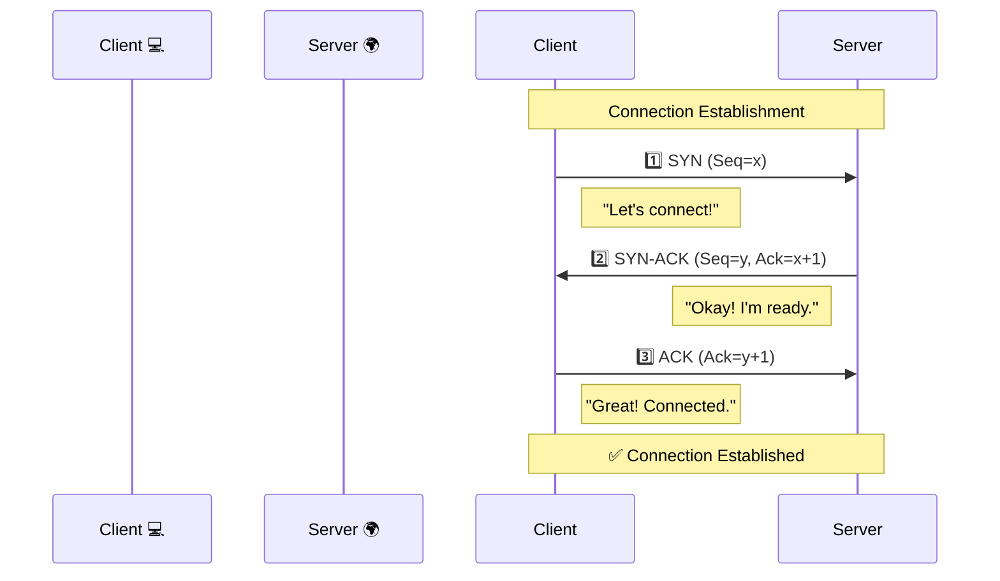

# 🤝 TCP Handshakes and 3-Way Handshakes
### 🚀 Navigation
[🏠 Home](../../README.md) `|` [🔙 Web Basics](../01%20Web%20Basics/README.md) `|` [Next: HTTP & HTTPS Protocols 🔜](./08-HTTP-and-HTTPS-Protocols.md)

## 📑 Table of Contents

- [What is a 3-way handshake in TCP?](#what-is-a-3-way-handshake-in-tcp)
- [Detailed breakdown of the 3 phases: SYN, SYN-ACK, and ACK](#detailed-breakdown-of-the-3-phases-syn-syn-ack-and-ack)
- [The purpose of the handshake: Establishing a reliable connection](#the-purpose-of-the-handshake-establishing-a-reliable-connection)
- [How data is transmitted after the handshake is complete](#how-data-is-transmitted-after-the-handshake-is-complete)
- [**Key Concepts:** Reliable connection establishment, Sequence numbers, Acknowledgments](#key-concepts-reliable-connection-establishment-sequence-numbers-acknowledgments)

---

###  What is a Handshake in TCP?

> A **handshake** in TCP is a process that establishes a connection between a client and a server. It ensures that both parties are ready to communicate and have agreed on the parameters of the connection.

### 🧐 What is a 3-Way Handshake in TCP?

> A **3-way handshake** is the process TCP uses to establish a **reliable connection** between a client and a server **before** any data transfer begins.

#### **Simple Explanation:**
Before TCP sends any data:
👉 **Client & Server** confirm with each other: *"Are you ready?"*

This confirmation happens in **3 steps**, hence the name **3-way handshake**.

#### **Why does TCP need this?**
1. To make sure **both sides are reachable**.
2. To agree on **initial sequence numbers**.
3. To avoid sending data into the void ❌.

---

### 🛠 Detailed Breakdown of the 3 Phases: SYN, SYN-ACK, and ACK

Let’s assume:
- **Client** = Browser 💻
- **Server** = Web Server 🌍

#### **1️⃣ SYN (Synchronize)**
* **Who sends?** → Client
* **Meaning:** "Hello Server, can we start a connection?"
* **What happens:**
    - Client sends a TCP packet with **SYN flag = 1**.
    - Client sends its **initial sequence number (ISN)**.
    - 📌 *No data yet, only intention.*

#### **2️⃣ SYN-ACK (Synchronize + Acknowledgment)**
* **Who sends?** → Server
* **Meaning:** "Yes Client, I’m ready. I acknowledge your request."
* **What happens:**
    - Server sends:
        - **SYN** (its own sequence number).
        - **ACK** (acknowledging client’s SYN).
    - 👉 Server says: *"I got your SYN, and here is mine."*

#### **3️⃣ ACK (Acknowledgment)**
* **Who sends?** → Client
* **Meaning:** "I acknowledge your SYN. Connection established."
* **What happens:**
    - Client sends **ACK**.
    - Acknowledges server’s sequence number.
    - 🎉 **Connection is now established.**

#### **🖼 Visual Flow**

---

### 🎯 The Purpose of the Handshake: Establishing a Reliable Connection

#### **Why is the handshake important?**

**Without a handshake:**
* ❌ Server may not exist.
* ❌ Server may not be ready.
* ❌ Sequence numbers won’t match.
* ❌ Data may be lost or duplicated.

**The handshake ensures:**
* ✅ Both client & server are **alive**.
* ✅ Both are **ready to communicate**.
* ✅ Sequence numbers are **synchronized**.
* ✅ A **reliable connection** is established.

> **💡:**
> "The TCP 3-way handshake ensures a reliable and synchronized connection **before** data transmission begins."

---

### 📡 How Data is Transmitted After the Handshake is Complete

Once the handshake is done 👇

#### **What changes?**
* Connection state becomes **ESTABLISHED**.
* Both sides know:
    * **Sequence numbers**
    * **Acknowledgment rules**

#### **Data Transfer Process:**
1. **Client sends data packets**
    * Each packet has a **Sequence number**.
2. **Server sends ACKs**
3. **If ACK is not received:**
    * TCP **retransmits** the packet.

👉 This continues until:
* All data is sent.
* Connection is closed (via **FIN handshake**).

---

### 🔑 Key Concepts: Reliable Connection Establishment, Sequence Numbers, Acknowledgments

#### **1. Reliable Connection Establishment**
TCP guarantees:
* No data is sent before the connection is ready.
* No guessing.
* No blind sending.

📌 **This is why:** HTTP/HTTPS and APIs depend on TCP.

#### **2. Sequence Numbers**
Sequence numbers are crucial to:
* Identify the **position** of data.
* Help in **reordering** packets.
* Detect **missing** packets.

**Example:**
* Packet 1 → `Seq 100`
* Packet 2 → `Seq 200`
* *If Seq 200 is missing → TCP knows exactly what to retransmit.*

#### **3. Acknowledgments (ACK)**
ACK means:
> *"I received data up to sequence number X"*

* If the sender doesn’t get an ACK:
    * Packet is assumed **lost**.
    * **Retransmission** is triggered.

📌 **ACKs are the heart of TCP reliability.**

---

### 📝 Quick Summary Note

| Concept | Description |
| :--- | :--- |
| **Mechanism** | TCP uses a 3-way handshake to establish connections. |
| **Steps** | **SYN** → **SYN-ACK** → **ACK** |
| **Goal** | Synchronize sequence numbers & ensure readiness. |
| **Data Transfer** | Starts **only after** connection is established. |
| **Reliability** | Ensured by **ACKs** and **Sequence Numbers**. |

### 🚀 Navigation
[🏠 Home](../../README.md) `|` [🔙 Web Basics](../01%20Web%20Basics/README.md) `|` [Next: HTTP & HTTPS Protocols 🔜](./08-HTTP-and-HTTPS-Protocols.md)