# HTTP & HTTPS Protocols

## Table of Contents

- [Introduction to HTTP (HyperText Transfer Protocol) and HTTPS (Secure version of HTTP)](#introduction-to-http-hypertext-transfer-protocol-and-https-secure-version-of-http)
- [What happens during an HTTP request-response cycle?](#what-happens-during-an-http-request-response-cycle)
- [Understanding status codes: 200 OK, 404 Not Found, 500 Internal Server Error](#understanding-status-codes-200-ok-404-not-found-500-internal-server-error)
- [Introduction to SSL/TLS and how it secures data during transmission](#introduction-to-ssltls-and-how-it-secures-data-during-transmission)
- [Key Concepts: Request methods (GET, POST, PUT, DELETE), HTTPS handshake, Certificate Authorities](#key-concepts-request-methods-get-post-put-delete-https-handshake-certificate-authorities)

---

### Introduction to HTTP (HyperText Transfer Protocol) and HTTPS (Secure Version of HTTP)

#### What is HTTP?

**HTTP (HyperText Transfer Protocol)** is an application-layer protocol used for communication between a client (browser) and a server on the web. It is the foundation of data communication for the World Wide Web.

👉 **HTTP defines:**
*   How requests are formatted and transmitted.
*   How web servers and browsers should respond to various commands.

> **Simple Interview Definition:**
> HTTP is a stateless request–response protocol used to transfer web resources (like HTML, images, JSON) between clients and servers.

#### Versions of HTTP

The protocol has evolved significantly over time:

*   **HTTP/0.9:** Simple, supported only GET method, no headers.
*   **HTTP/1.0:** Basic, introduced headers, status codes, and POST method.
*   **HTTP/1.1:** The standard for many years. Introduced persistent connections (Keep-Alive) and chunked transfer encoding.
*   **HTTP/2:** Major revision focused on performance. Introduced multiplexing (multiple requests over one connection) and header compression.
*   **HTTP/3:** The latest version. Uses **QUIC** (Quick UDP Internet Connections) instead of TCP for faster, more reliable connections.

#### Comparison of HTTP Versions

| Feature | HTTP/1.0 | HTTP/1.1 | HTTP/2 | HTTP/3 |
| :--- | :--- | :--- | :--- | :--- |
| **Connection** | New TCP connection per request | Persistent TCP connections (Keep-Alive) | Single TCP connection (Multiplexing) | **QUIC** (UDP-based) |
| **Transport** | TCP | TCP | TCP | UDP |
| **Header Compression** | No | No | Yes (HPACK) | Yes (QPACK) |
| **Performance** | Slow (Head-of-line blocking) | Better, but still sequential | Fast (Parallel streams) | Fastest (Low latency) |

---

#### What is HTTPS?

**HTTPS (HTTP Secure)** is the secure version of HTTP.

👉 **Formula:** `HTTPS = HTTP + SSL/TLS encryption`

**Key Difference:**
*   **HTTP** ❌ → Data is sent in **Plain Text** (anyone intercepting can read it).
*   **HTTPS** ✅ → Data is **Encrypted** (scrambled so only the recipient can read it).

📌 *Today, almost all modern websites use HTTPS for security and SEO ranking.*

#### HTTP vs HTTPS (Quick View)

| Feature | HTTP | HTTPS |
| :--- | :--- | :--- |
| **Security** | Not secure | Secure |
| **Encryption** | No | Yes (TLS/SSL) |
| **Default Port** | 80 | 443 |
| **Data Safety** | Low (Vulnerable to eavesdropping) | High (Encrypted transit) |
| **SEO & Trust** | Poor (Marked "Not Secure" by browsers) | Better (Google ranking signal) |

---

### What Happens During an HTTP Request-Response Cycle?

When you type a URL into your browser, a complex series of steps occurs in milliseconds.

#### Step-by-Step Flow

1.  **User Action:** User enters a URL in the browser.
2.  **DNS Resolution:** Browser asks a DNS server for the IP address of the domain.
3.  **TCP Connection:** A connection is established between the browser and the server (3-way handshake).
4.  **Send Request:** Browser sends an HTTP request message.
5.  **Process Request:** Server receives the request, processes it (runs logic, queries DB).
6.  **Send Response:** Server sends back an HTTP response message.
7.  **Render:** Browser receives the response (HTML/JSON) and renders the content.

#### Visual Flow Diagram

#### Anatomy of a Request & Response

**HTTP Request Contains:**
*   **Method:** (GET, POST, PUT, DELETE, etc.)
*   **URL:** The path to the resource.
*   **Headers:** Metadata (User-Agent, Content-Type, Cookies).
*   **Body:** (Optional) Data sent to the server (used in POST/PUT).

**HTTP Response Contains:**
*   **Status Code:** (200, 404, 500, etc.)
*   **Headers:** Metadata (Content-Type, Set-Cookie, Cache-Control).
*   **Body:** The actual content (HTML, JSON, Image).

> HTTP follows a request–response model where the client initiates communication and the server responds with resources.

---

### Understanding Status Codes: 200 OK, 404 Not Found, 500 Internal Server Error

Status codes are 3-digit numbers returned by the server to indicate the outcome of the request.

#### Category Overview

| Range | Category | Meaning |
| :--- | :--- | :--- |
| **1xx** | Informational | Request received, continuing process. |
| **2xx** | Success | The action was successfully received, understood, and accepted. |
| **3xx** | Redirection | Further action must be taken to complete the request. |
| **4xx** | Client Error | The request contains bad syntax or cannot be fulfilled. |
| **5xx** | Server Error | The server failed to fulfill an apparently valid request. |

#### Common Status Codes Explained

*   **✅ 200 OK:**
    *   **Meaning:** Request was successful.
    *   **Result:** The requested resource (HTML, JSON) is returned in the body.

*   **❌ 404 Not Found:**
    *   **Meaning:** The server cannot find the requested resource.
    *   **Cause:** Wrong URL, deleted page, or broken link.

*   **❌ 500 Internal Server Error:**
    *   **Meaning:** The server encountered an unexpected condition.
    *   **Cause:** Bug in the backend code, database crash, or server misconfiguration.

>  **📌:**
> Remember the distinction: **4xx** errors are *your fault* (the client/browser sent something wrong), while **5xx** errors are *their fault* (the server crashed or failed).

---

### Introduction to SSL/TLS and How It Secures Data During Transmission

#### What is SSL/TLS?

**SSL (Secure Sockets Layer)** and its successor **TLS (Transport Layer Security)** are cryptographic protocols designed to provide communications security over a computer network.

👉 **Note:** While we often say "SSL Certificate," modern HTTPS actually uses **TLS**, which is the newer, more secure version of SSL.

#### What TLS Provides (The CIA Triad)

1.  **🔒 Encryption (Confidentiality):**
    *   Data is turned into unreadable code. Even if a hacker intercepts the packets, they look like gibberish.
2.  **🧾 Authentication (Identity):**
    *   Verifies that the server is who it claims to be. This prevents you from logging into a fake bank website.
3.  **🔐 Data Integrity:**
    *   Ensures that data has not been altered or tampered with during transit.

#### Why is TLS Important?

**Without TLS (HTTP):**
*   Passwords are sent in plain text ❌
*   Credit card numbers can be stolen ❌
*   Susceptible to Man-in-the-Middle (MITM) attacks ❌

---

### Key Concepts: Request Methods, HTTPS Handshake, Certificate Authorities

#### 1. Request Methods (HTTP Verbs)

These methods tell the server *what* action you want to perform on a resource.

*   **GET:**
    *   **Purpose:** Retrieve data.
    *   **Body:** No body.
    *   **Properties:** Safe (doesn't change data) & Idempotent (repeating the request has same effect).
*   **POST:**
    *   **Purpose:** Submit data to be processed (e.g., create a user).
    *   **Body:** Yes, contains the data.
    *   **Properties:** Not idempotent (repeating it might create duplicates).
*   **PUT:**
    *   **Purpose:** Update/Replace an existing resource entirely.
*   **DELETE:**
    *   **Purpose:** Remove a resource.

**Summary Table:**

| Method | Purpose | CRUD Operation |
| :--- | :--- | :--- |
| **GET** | Read data | Read |
| **POST** | Create data | Create |
| **PUT** | Update data | Update |
| **DELETE** | Remove data | Delete |

#### 2. HTTPS Handshake (TLS Handshake)

Before any actual data is sent, the browser and server must agree on a secret code (encryption key). This process is called the **Handshake**.

**Simplified Flow:**

1.  **Client Hello:** Browser sends supported encryption methods.
2.  **Server Hello:** Server picks a method and sends its **SSL Certificate**.
3.  **Verification:** Browser checks if the certificate is valid and trusted.
4.  **Key Exchange:** They securely exchange/generate a **Session Key**.
5.  **Secure Connection:** All future messages are encrypted using this Session Key.

```mermaid
sequenceDiagram
    participant Client
    participant Server
    Note over Client, Server: TCP Connection Established
    Client->>Server: 1. Client Hello (I support these ciphers)
    Server->>Client: 2. Server Hello + Certificate (Public Key)
    Client->>Client: 3. Verifies Certificate with CA
    Client->>Server: 4. Key Exchange (Encrypted with Public Key)
    Note over Client, Server: Both generate Session Key
    Client->>Server: 5. Finished (Encrypted)
    Server->>Client: 6. Finished (Encrypted)
    Note over Client, Server: Secure Data Transmission Begins 🔒
```

#### 3. Certificate Authorities (CA)

A **Certificate Authority (CA)** is a trusted third-party organization that issues digital certificates. They act as the "ID card issuers" of the internet.

**Examples:**
*   DigiCert
*   Let’s Encrypt (Free, open source)
*   GlobalSign

**Role of CA:**
*   **Verification:** They verify that the owner of the website actually owns the domain name.
*   **Trust:** Browsers (Chrome, Firefox) have a pre-installed list of trusted CAs. If a CA signs a certificate, the browser trusts that website.

---

> 💡 **Quick Recap / Cheatsheet**
> *   **HTTP** is a stateless request-response protocol.
> *   **HTTPS** is HTTP secured with TLS encryption.
> *   **Status Codes** tell you if a request worked (200), failed because of you (404), or failed because of the server (500).
> *   **TLS** provides Encryption, Authentication, and Integrity.
> *   **Certificate Authorities** are the "trust anchors" that validate website identities.

